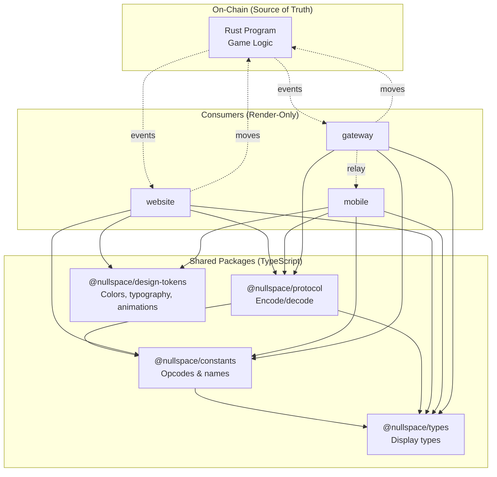
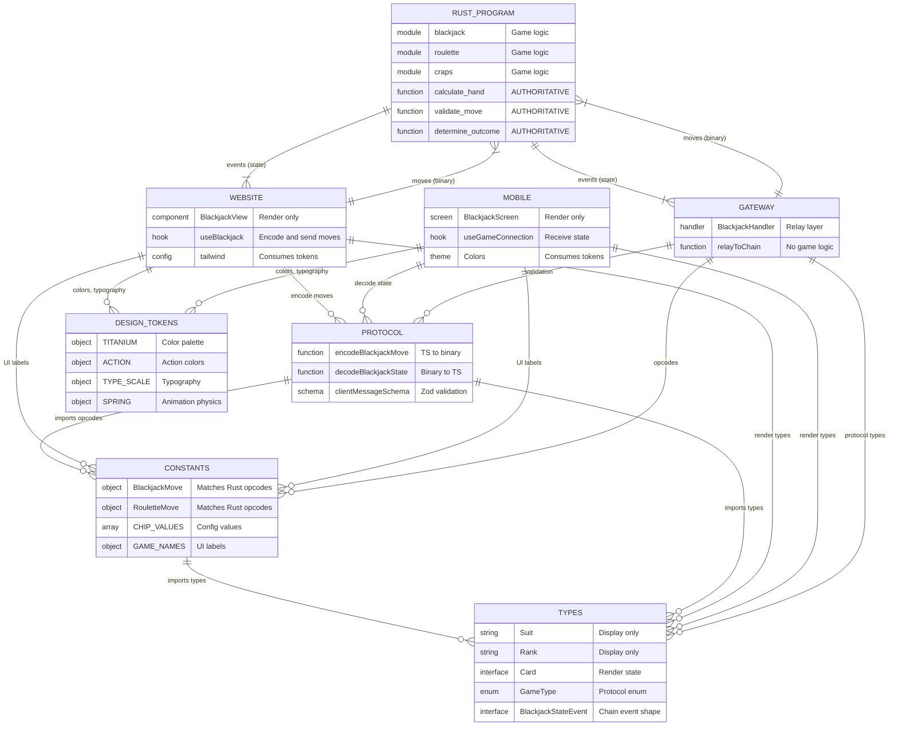

# feat: Shared Packages Monorepo Architecture

> **Strategic solution to prevent web/mobile/gateway code divergence**

## Overview

This plan establishes a TypeScript monorepo architecture with shared packages to eliminate code duplication and type divergence between the nullspace website, mobile app, and gateway server.

**Current State:** Three independent codebases with duplicated types, diverged implementations, and fragile cross-project imports.

**Target State:** Unified monorepo with `@nullspace/types`, `@nullspace/constants`, and `@nullspace/protocol` packages consumed by all projects.

---

## ⚠️ CRITICAL ARCHITECTURAL PRINCIPLE

**The on-chain Rust program is the SOLE SOURCE OF TRUTH for all game logic.**

The frontends (web and mobile) are **render-only** - they:
1. Encode user actions into move payloads
2. Send payloads to the chain
3. Receive and render state updates from chain events

**Shared TypeScript packages MUST NOT contain:**
- Game scoring logic (e.g., `calculateHandTotal`)
- Game validation logic (e.g., `canSplit`, `canDouble`)
- Outcome determination (e.g., `isBusted`, `isBlackjack`)
- Any logic that duplicates what the Rust program computes

**TypeScript packages SHOULD contain:**
- Wire protocol types (message shapes, event structures)
- Move opcode constants (matching Rust exactly)
- Payload encoding/decoding (TypeScript ↔ Uint8Array)
- Display constants (game names, emojis, colors)
- Type definitions for rendering chain state

**App-layer exceptions (allowed):**
- Local exposure/hand-evaluation helpers for UI previews and staging only
- Must be marked non-authoritative and never override chain results
- Must have parity fixtures generated from Rust logic (no blockchain calls) to prevent drift

### Display vs Rule Constants

| Category | OK in TypeScript | Why |
|----------|-----------------|-----|
| **Display Constants** | ✅ Yes | No logic, just UI labels |
| `SUIT_SYMBOLS` (`'hearts'` → `'♥'`) | ✅ Yes | Mapping for rendering, not game logic |
| `SUIT_COLORS` (`'hearts'` → `'red'`) | ✅ Yes | Display styling only |
| `GAME_DISPLAY_NAMES`, `GAME_EMOJIS` | ✅ Yes | UI labels |
| `CHIP_VALUES` (denominations) | ✅ Yes | Button amounts to display |
| Spring physics, animation timing | ✅ Yes | UI behavior only |
| **Rule/Config Constants** | ❌ No | Duplicates chain enforcement |
| `MIN_BET`, `MAX_BET` | ❌ Fetch from chain | Chain enforces limits |
| `canSplit`, `canDouble` logic | ❌ Chain event flags | Chain computes validity |
| Hand total calculation | ❌ Chain computes | Scoring is game logic |
| Payout ratios | ❌ Fetch from chain | Chain enforces payouts |

**Key principle:** If the chain ENFORCES a value or COMPUTES a result, TypeScript must not duplicate it. Fetch it at runtime or receive it in events.

---

## 📋 Review Findings (Critical Points)

Three independent reviews identified the following critical points that have been incorporated:

### Architecture Simplification (DHH Review)

| Finding | Resolution |
|---------|------------|
| 5 packages may be over-engineered | Consider consolidating to `@nullspace/shared` with subpath exports in v2 |
| Turborepo may be premature | Start with pnpm workspaces only; add Turborepo if build times exceed 30s |
| Design tokens package deferrable | Keep in plan but mark as optional Phase 5; implement only if design divergence becomes a problem |
| tsconfig package adds indirection | Use root `tsconfig.base.json` extended with relative paths instead |

### TypeScript Quality (Kieran Review)

| Finding | Status |
|---------|--------|
| Use `satisfies` for type-safe opcode maps | ✅ Fixed in encode.ts |
| Silent fallbacks in decode functions mask errors | ⚠️ **TODO:** Add `ProtocolError` class, throw on invalid bytes |
| Missing return type annotations on public functions | ⚠️ **TODO:** Add explicit return types to all public protocol functions |
| `val in GameType` incorrect for numeric enums | ⚠️ **TODO:** Use `Object.values(GameType).includes(val)` |
| Missing bigint bounds validation for Rust u64 | ⚠️ **TODO:** Add `.refine(val => BigInt(val) <= 2n ** 64n - 1n)` |
| `as any` in tests defeats type safety | ✅ Fixed with typed fixtures |

### Simplicity (Code Simplicity Review)

| Finding | Resolution |
|---------|------------|
| 2138-line plan for ~700 lines of code | Acknowledged; complete code examples moved to implementation, plan remains reference |
| Golden vector testing infrastructure may be overkill | Keep as optional verification; unit tests + integration tests may suffice initially |
| Single `@nullspace/shared` package could work | Valid alternative; current structure allows gradual simplification |

### Open Implementation TODOs from Reviews

```typescript
// TODO: Add ProtocolError class for decode failures
class ProtocolError extends Error {
  constructor(message: string) {
    super(message);
    this.name = 'ProtocolError';
  }
}

// TODO: Fix gameTypeSchema validation for numeric enum
const gameTypeSchema = z.number().int().min(0).max(9).refine(
  (val): val is GameType => Object.values(GameType).includes(val),
  { message: 'Invalid game type' }
);

// TODO: Add bigint bounds for Rust u64 in bet validation
bet: z.string().regex(/^\d+$/).refine(
  (val) => BigInt(val) <= 2n ** 64n - 1n,
  { message: 'Bet exceeds maximum value (u64 max)' }
),
```

---

## Problem Statement

### Evidence of Divergence

| Component | Website | Mobile | Gateway |
|-----------|---------|--------|---------|
| `Suit` type | `'♠'\|'♥'\|'♦'\|'♣'` (Unicode) | `'hearts'\|'diamonds'\|'clubs'\|'spades'` (strings) | N/A |
| `GameType` | `enum GameType { ... }` | `const GAME_TYPES = { ... }` | `const GameType = { ... }` |
| Move opcodes | `new Uint8Array([0])` in hooks | `{ type: 'blackjack_hit' }` JSON | `BlackjackMove.Hit = 0` |
| Validation | Inline in components | Zod schemas | Zod schemas (different) |

### Risk Profile

- **New game added:** 3+ files must be updated independently
- **Protocol change:** Easy to miss one consumer → runtime errors
- **New developer:** Unclear which types are canonical
- **Mobile already fragile:** Imports `../../../gateway/src/codec/bet-types` directly

---

## Proposed Solution

### Package Architecture

```
nullspace/
├── pnpm-workspace.yaml
├── package.json                    # Root with workspaces
├── turbo.json                      # Build orchestration
├── tsconfig.json                   # Solution-style references
├── packages/
│   ├── types/                      # @nullspace/types
│   │   ├── src/
│   │   │   ├── index.ts
│   │   │   ├── game.ts            # GameType, GameSession (render state)
│   │   │   ├── cards.ts           # Suit, Rank, Card (display types)
│   │   │   ├── player.ts          # Player, Balance (account state)
│   │   │   ├── events.ts          # Chain event payload types
│   │   │   └── casino.ts          # Casino event/session types (subpath export)
│   │   ├── package.json
│   │   └── tsconfig.json
│   ├── constants/                  # @nullspace/constants
│   │   ├── src/
│   │   │   ├── index.ts
│   │   │   ├── games.ts           # GAME_IDS, GAME_NAMES, GAME_EMOJIS
│   │   │   ├── moves.ts           # Move opcodes per game (MUST match Rust)
│   │   │   ├── chips.ts           # CHIP_VALUES, bet fallbacks
│   │   │   └── bet-types.ts       # Bet type enums + helpers (baccarat/craps/etc)
│   │   ├── package.json
│   │   └── tsconfig.json
│   │   # NOTE: Colors/typography/animations live in @nullspace/design-tokens
│   ├── protocol/                   # @nullspace/protocol
│   │   ├── src/
│   │   │   ├── index.ts
│   │   │   ├── encode.ts          # TypeScript → Uint8Array (for chain)
│   │   │   ├── decode.ts          # Chain events → TypeScript
│   │   │   ├── websocket.ts       # Gateway message types (mobile)
│   │   │   ├── validation.ts      # Zod schemas for incoming data
│   │   │   └── mobile.ts          # Mobile gateway schemas + helpers
│   │   ├── package.json
│   │   └── tsconfig.json
│   ├── design-tokens/              # @nullspace/design-tokens
│   │   ├── src/
│   │   │   ├── index.ts
│   │   │   ├── colors.ts          # Titanium palette, action colors (raw values)
│   │   │   ├── spacing.ts         # Spacing scale (4, 8, 12, 16, 24...)
│   │   │   ├── typography.ts      # Font families, sizes, weights (raw values)
│   │   │   ├── animations.ts      # Spring configs (mass, stiffness, damping)
│   │   │   ├── shadows.ts         # Shadow elevation definitions
│   │   │   └── assets.ts          # Optional: SVG paths/patterns as data
│   │   ├── package.json
│   │   └── tsconfig.json
│   └── tsconfig/                   # @nullspace/tsconfig
│       ├── base.json
│       ├── react.json
│       ├── react-native.json
│       └── node.json
├── website/                        # Consumes @nullspace/* (render-only)
├── mobile/                         # Consumes @nullspace/* (render-only)
└── gateway/                        # Consumes @nullspace/* (relay layer)
```

**Note:** There is intentionally NO `@nullspace/game-logic` package. Game logic lives exclusively in the Rust on-chain program. The frontends receive computed game state from chain events and render it directly.

### Dependency Graph



**Note:** Gateway does not need design-tokens (server-side only, no UI).

---

## Technical Approach

### Phase 1: Foundation (Infrastructure Setup)

**Objective:** Establish monorepo tooling without breaking existing code.

#### 1.1 Create Root Configuration

**pnpm-workspace.yaml**
```yaml
packages:
  - 'packages/*'
  - 'website'
  - 'mobile'
  - 'gateway'
```

**package.json** (root)
```json
{
  "name": "nullspace",
  "private": true,
  "packageManager": "pnpm@9.15.0",
  "scripts": {
    "build": "turbo build",
    "dev": "turbo dev",
    "lint": "turbo lint",
    "type-check": "turbo type-check",
    "test": "turbo test",
    "clean": "turbo clean && rm -rf node_modules"
  },
  "devDependencies": {
    "turbo": "^2.3.0"
  }
}
```

**turbo.json**
```json
{
  "$schema": "https://turborepo.com/schema.json",
  "tasks": {
    "build": {
      "dependsOn": ["^build"],
      "outputs": ["dist/**"],
      "inputs": ["src/**", "package.json", "tsconfig.json", "tsconfig.build.json"]
    },
    "dev": {
      "dependsOn": ["^build"],
      "cache": false,
      "persistent": true
    },
    "type-check": {
      "dependsOn": ["^build"],
      "inputs": ["src/**", "tsconfig.json", "tsconfig.build.json"]
    },
    "test": {
      "dependsOn": ["^build"],
      "outputs": ["coverage/**"],
      "inputs": ["src/**", "test/**"]
    },
    "lint": {
      "inputs": ["src/**", "*.config.js", "*.config.ts"]
    },
    "clean": {
      "cache": false
    }
  }
}
```

#### 1.1.1 Build Strategy Decision

> **Decision:** Shared packages compile TypeScript to `dist/` and export compiled JS.

**Why compiled exports (not source exports):**
- Gateway (Node.js server) can run without tsx/ts-node dependency
- Turborepo caching works correctly with `dist/**` outputs
- Consumers don't need TypeScript compilation awareness
- Type declarations (`.d.ts`) are generated alongside JS

**Package export pattern:**
```json
{
  "exports": {
    ".": {
      "types": "./dist/index.d.ts",
      "import": "./dist/index.js"
    }
  },
  "scripts": {
    "build": "tsc -p tsconfig.build.json",
    "dev": "tsc -p tsconfig.build.json --watch"
  }
}
```

**Exception:** `@nullspace/tsconfig` exports raw JSON files (no compilation needed).

**.npmrc**
```ini
shamefully-hoist=true
auto-install-peers=true
strict-peer-dependencies=false
```

#### 1.2 Create Shared TypeScript Configuration

**packages/tsconfig/base.json**
```json
{
  "$schema": "https://json.schemastore.org/tsconfig",
  "compilerOptions": {
    "target": "ES2022",
    "module": "NodeNext",
    "moduleResolution": "NodeNext",
    "lib": ["ES2022"],
    "strict": true,
    "esModuleInterop": true,
    "skipLibCheck": true,
    "forceConsistentCasingInFileNames": true,
    "resolveJsonModule": true,
    "isolatedModules": true,
    "verbatimModuleSyntax": true,
    "declaration": true,
    "declarationMap": true,
    "sourceMap": true
  }
}
```

> ⚠️ **ESM Import Extensions Required**
>
> With `moduleResolution: "NodeNext"`, all relative imports in source files **must** include `.js` extensions:
> ```typescript
> // ✅ Correct
> export * from './cards.js';
> import { Card } from './cards.js';
>
> // ❌ Wrong - will fail at Node runtime
> export * from './cards';
> import { Card } from './cards';
> ```
> This ensures emitted JS is directly runnable in Node without bundlers/transpilers.
> The gateway consumes shared packages as ESM, so this is required.

**packages/tsconfig/react.json**
```json
{
  "extends": "./base.json",
  "compilerOptions": {
    "lib": ["ES2022", "DOM", "DOM.Iterable"],
    "jsx": "react-jsx",
    "noEmit": true
  }
}
```

**packages/tsconfig/react-native.json**
```json
{
  "extends": "./base.json",
  "compilerOptions": {
    "lib": ["ES2022"],
    "jsx": "react-jsx",
    "noEmit": true
  }
}
```

**packages/tsconfig/node.json**
```json
{
  "extends": "./base.json",
  "compilerOptions": {
    "lib": ["ES2022"],
    "module": "NodeNext",
    "moduleResolution": "NodeNext",
    "outDir": "dist",
    "rootDir": "src"
  }
}
```

**packages/tsconfig/package.json**
```json
{
  "name": "@nullspace/tsconfig",
  "version": "0.0.0",
  "private": true,
  "exports": {
    "./base.json": "./base.json",
    "./react.json": "./react.json",
    "./react-native.json": "./react-native.json",
    "./node.json": "./node.json"
  },
  "files": ["*.json"]
}
```

#### 1.3 Verification Criteria

- [ ] `pnpm install` runs successfully from root
- [ ] `pnpm build` runs without errors (even if empty packages)
- [ ] Existing website/mobile/gateway continue to work unchanged
- [ ] IDE recognizes workspace structure

---

### Phase 2: Core Types Package

**Objective:** Create `@nullspace/types` with unified type definitions.

#### 2.1 Package Structure

**packages/types/package.json**
```json
{
  "name": "@nullspace/types",
  "version": "0.0.0",
  "private": true,
  "type": "module",
  "exports": {
    ".": {
      "types": "./dist/index.d.ts",
      "import": "./dist/index.js"
    },
    "./game": {
      "types": "./dist/game.d.ts",
      "import": "./dist/game.js"
    },
    "./cards": {
      "types": "./dist/cards.d.ts",
      "import": "./dist/cards.js"
    },
    "./player": {
      "types": "./dist/player.d.ts",
      "import": "./dist/player.js"
    },
    "./events": {
      "types": "./dist/events.d.ts",
      "import": "./dist/events.js"
    }
  },
  "scripts": {
    "build": "tsc -p tsconfig.build.json",
    "dev": "tsc -p tsconfig.build.json --watch",
    "type-check": "tsc --noEmit",
    "lint": "eslint src --max-warnings 0",
    "clean": "rm -rf dist"
  },
  "devDependencies": {
    "@nullspace/tsconfig": "workspace:*",
    "typescript": "^5.7.0"
  }
}
```

**packages/types/tsconfig.build.json**
```json
{
  "extends": "./tsconfig.json",
  "compilerOptions": {
    "noEmit": false,
    "declaration": true,
    "declarationMap": true,
    "outDir": "dist"
  },
  "exclude": ["**/*.test.ts", "dist"]
}
```

**packages/types/tsconfig.json**
```json
{
  "extends": "@nullspace/tsconfig/base.json",
  "compilerOptions": {
    "composite": true,
    "rootDir": "src",
    "outDir": "dist"
  },
  "include": ["src"]
}
```

#### 2.2 Canonical Type Definitions

**packages/types/src/cards.ts**
```typescript
/**
 * Canonical card representations
 * Decision: Use string literals for JSON compatibility across all platforms
 */

export type Suit = 'hearts' | 'diamonds' | 'clubs' | 'spades';
export type Rank = 'A' | '2' | '3' | '4' | '5' | '6' | '7' | '8' | '9' | '10' | 'J' | 'Q' | 'K';

export interface Card {
  suit: Suit;
  rank: Rank;
  faceUp?: boolean;
}

/** Unicode symbols for display (derived from Suit) */
export const SUIT_SYMBOLS: Record<Suit, string> = {
  hearts: '♥',
  diamonds: '♦',
  clubs: '♣',
  spades: '♠',
};

export const SUIT_COLORS: Record<Suit, 'red' | 'black'> = {
  hearts: 'red',
  diamonds: 'red',
  clubs: 'black',
  spades: 'black',
};
```

**packages/types/src/game.ts**
```typescript
/**
 * Game type definitions
 * MUST match Rust enum in types/src/casino/game.rs
 */

export enum GameType {
  Baccarat = 0,
  Blackjack = 1,
  CasinoWar = 2,
  Craps = 3,
  VideoPoker = 4,
  HiLo = 5,
  Roulette = 6,
  SicBo = 7,
  ThreeCard = 8,
  UltimateHoldem = 9,
}

export type GameId =
  | 'baccarat'
  | 'blackjack'
  | 'casino_war'
  | 'craps'
  | 'video_poker'
  | 'hi_lo'
  | 'roulette'
  | 'sic_bo'
  | 'three_card_poker'
  | 'ultimate_texas_holdem';

export interface GameSession {
  id: bigint;
  gameType: GameType;
  bet: bigint;
  isComplete: boolean;
  moveCount: number;
  createdAt: bigint;
}
```

**packages/types/src/player.ts**
```typescript
export interface Player {
  publicKey: Uint8Array;
  publicKeyHex: string;
  name: string;
  chips: bigint;
  shields: number;
  doubles: number;
  rank: number;
}

export interface PlayerBalance {
  chips: bigint;
  vusdtBalance: bigint;
  shields: number;
  doubles: number;
}
```

**packages/types/src/events.ts**
```typescript
/**
 * Chain event payload types for rendering
 * These types describe the shape of data received from chain events.
 * The chain computes all values - frontends just render them.
 */

import type { GameType } from './game.js';
import type { Card } from './cards.js';

/** Base event structure from chain */
export interface ChainEvent {
  eventType: string;
  timestamp: bigint;
}

/** Game started event - initial state for rendering */
export interface GameStartedEvent extends ChainEvent {
  eventType: 'GameStarted';
  sessionId: bigint;
  gameType: GameType;
  player: Uint8Array;
  bet: bigint;
}

/** Blackjack state from chain - render directly, no local calculation */
export interface BlackjackStateEvent extends ChainEvent {
  eventType: 'BlackjackState';
  sessionId: bigint;
  playerCards: Card[];
  dealerCards: Card[];
  playerTotal: number;   // Chain-computed, just display it
  dealerTotal: number;   // Chain-computed, just display it
  stage: 'betting' | 'playing' | 'dealer_turn' | 'complete';
  canHit: boolean;       // Chain tells us valid actions
  canStand: boolean;
  canDouble: boolean;
  canSplit: boolean;
}

/** Game result event - outcome determined by chain */
export interface GameResultEvent extends ChainEvent {
  eventType: 'GameResult';
  sessionId: bigint;
  gameType: GameType;
  won: boolean;
  payout: bigint;
  message: string;
}

/** Balance update after game completion */
export interface BalanceUpdateEvent extends ChainEvent {
  eventType: 'BalanceUpdate';
  player: Uint8Array;
  newBalance: bigint;
  delta: bigint;
}

export type AnyChainEvent =
  | GameStartedEvent
  | BlackjackStateEvent
  | GameResultEvent
  | BalanceUpdateEvent;
```

**packages/types/src/index.ts**
```typescript
export * from './cards.js';
export * from './game.js';
export * from './player.js';
export * from './events.js';
// NOTE: WebSocket protocol types live in @nullspace/protocol/websocket
// Do NOT add protocol types here - they would drift from the authoritative source
```

#### 2.3 Verification Criteria

- [ ] `pnpm --filter @nullspace/types type-check` passes
- [ ] Types can be imported: `import { Card, GameType } from '@nullspace/types'`
- [ ] IDE autocomplete works for exported types
- [ ] **Display constants allowed:** `SUIT_SYMBOLS`, `SUIT_COLORS` are pure display mappings (see "Display vs Rule Constants" table)
- [ ] **NO game logic or rule constants:** No scoring, validation, or chain-enforced values
- [ ] **WebSocket types NOT exported here** - use `@nullspace/protocol/websocket` instead

---

### Phase 3: Constants Package

**Objective:** Create `@nullspace/constants` for shared configuration values.

#### 3.1 Package Structure

**packages/constants/package.json**
```json
{
  "name": "@nullspace/constants",
  "version": "0.0.0",
  "private": true,
  "type": "module",
  "exports": {
    ".": {
      "types": "./dist/index.d.ts",
      "import": "./dist/index.js"
    },
    "./games": {
      "types": "./dist/games.d.ts",
      "import": "./dist/games.js"
    },
    "./moves": {
      "types": "./dist/moves.d.ts",
      "import": "./dist/moves.js"
    },
    "./chips": {
      "types": "./dist/chips.d.ts",
      "import": "./dist/chips.js"
    }
  },
  "scripts": {
    "build": "tsc -p tsconfig.build.json",
    "dev": "tsc -p tsconfig.build.json --watch",
    "type-check": "tsc --noEmit",
    "clean": "rm -rf dist"
  },
  "dependencies": {
    "@nullspace/types": "workspace:*"
  },
  "devDependencies": {
    "@nullspace/tsconfig": "workspace:*",
    "typescript": "^5.7.0"
  }
}
```

**packages/constants/tsconfig.json**
```json
{
  "extends": "@nullspace/tsconfig/base.json",
  "compilerOptions": {
    "composite": true,
    "rootDir": "src",
    "outDir": "dist"
  },
  "include": ["src"]
}
```

**packages/constants/tsconfig.build.json**
```json
{
  "extends": "./tsconfig.json",
  "compilerOptions": {
    "noEmit": false,
    "declaration": true,
    "declarationMap": true,
    "outDir": "dist"
  },
  "exclude": ["**/*.test.ts", "dist"]
}
```

#### 3.2 Constant Definitions

**packages/constants/src/games.ts**
```typescript
import type { GameId, GameType } from '@nullspace/types';

export const GAME_TYPE_TO_ID: Record<GameType, GameId> = {
  [0]: 'baccarat',
  [1]: 'blackjack',
  [2]: 'casino_war',
  [3]: 'craps',
  [4]: 'video_poker',
  [5]: 'hi_lo',
  [6]: 'roulette',
  [7]: 'sic_bo',
  [8]: 'three_card_poker',
  [9]: 'ultimate_texas_holdem',
};

export const GAME_DISPLAY_NAMES: Record<GameId, string> = {
  baccarat: 'Baccarat',
  blackjack: 'Blackjack',
  casino_war: 'Casino War',
  craps: 'Craps',
  video_poker: 'Video Poker',
  hi_lo: 'Hi-Lo',
  roulette: 'Roulette',
  sic_bo: 'Sic Bo',
  three_card_poker: 'Three Card Poker',
  ultimate_texas_holdem: 'Ultimate Texas Hold\'em',
};

export const GAME_EMOJIS: Record<GameId, string> = {
  baccarat: '👑',
  blackjack: '🃏',
  casino_war: '⚔️',
  craps: '🎯',
  video_poker: '🎰',
  hi_lo: '🎲',
  roulette: '🎡',
  sic_bo: '🀄',
  three_card_poker: '🎴',
  ultimate_texas_holdem: '🤠',
};
```

**packages/constants/src/moves.ts**
```typescript
/**
 * Move opcodes per game
 * MUST match Rust constants in execution/src/casino/*.rs
 */

export const BlackjackMove = {
  Hit: 0,
  Stand: 1,
  Double: 2,
  Split: 3,
  Deal: 4,
  Set21Plus3: 5,
  Reveal: 6,
  Surrender: 7,
} as const;

export const RouletteMove = {
  PlaceBet: 0,
  Spin: 1,
  ClearBets: 2,
  SetRules: 3,
  AtomicBatch: 4,
} as const;

export const CrapsMove = {
  PlaceBet: 0,
  AddOdds: 1,
  Roll: 2,
  ClearBets: 3,
  AtomicBatch: 4,
} as const;

// ... other games

export type BlackjackMoveType = typeof BlackjackMove[keyof typeof BlackjackMove];
export type RouletteMoveType = typeof RouletteMove[keyof typeof RouletteMove];
```

**packages/constants/src/chips.ts**
```typescript
/**
 * Chip denominations for UI display (button amounts)
 * These are display-only - actual bet validation happens on-chain
 */
export const CHIP_VALUES = [1, 5, 25, 100, 500, 1000] as const;
export type ChipValue = typeof CHIP_VALUES[number];

/**
 * ⚠️ NO MIN_BET / MAX_BET here!
 *
 * Bet limits are chain-enforced rules. Fetch them at runtime:
 * - Website: GET /api/config → { minBet, maxBet, ... }
 * - Mobile: WebSocket config message from gateway
 * - Gateway: Read from chain config at startup
 *
 * Example usage in frontend:
 *   const { minBet, maxBet } = useCasinoConfig();
 *   <Slider min={minBet} max={maxBet} />
 */

// Default fallbacks ONLY for initial render before config loads
// These are NOT authoritative - chain values override
export const BET_LIMIT_FALLBACKS = {
  minBet: 1n,
  maxBet: 10000n,
  defaultBet: 10n,
} as const;
```

#### 3.3 Verification Criteria

- [ ] Constants importable: `import { BlackjackMove, CHIP_VALUES } from '@nullspace/constants'`
- [ ] Type inference works: `BlackjackMove.Hit` infers as `0`
- [ ] No circular dependencies with `@nullspace/types`

---

### Phase 4: Protocol Package

**Objective:** Create `@nullspace/protocol` for encoding moves and decoding chain events.

> ⚠️ **This package does NOT contain game logic.** It only handles serialization between TypeScript and the binary format expected by the on-chain Rust program.

#### 4.1 Package Structure

**packages/protocol/package.json**
```json
{
  "name": "@nullspace/protocol",
  "version": "0.0.0",
  "private": true,
  "type": "module",
  "exports": {
    ".": {
      "types": "./dist/index.d.ts",
      "import": "./dist/index.js"
    },
    "./encode": {
      "types": "./dist/encode.d.ts",
      "import": "./dist/encode.js"
    },
    "./decode": {
      "types": "./dist/decode.d.ts",
      "import": "./dist/decode.js"
    },
    "./websocket": {
      "types": "./dist/websocket.d.ts",
      "import": "./dist/websocket.js"
    },
    "./validation": {
      "types": "./dist/validation.d.ts",
      "import": "./dist/validation.js"
    }
  },
  "scripts": {
    "build": "tsc -p tsconfig.build.json",
    "dev": "tsc -p tsconfig.build.json --watch",
    "type-check": "tsc --noEmit",
    "test": "vitest run",
    "clean": "rm -rf dist"
  },
  "dependencies": {
    "@nullspace/types": "workspace:*",
    "@nullspace/constants": "workspace:*",
    "zod": "^3.23.0"
  },
  "devDependencies": {
    "@nullspace/tsconfig": "workspace:*",
    "typescript": "^5.7.0",
    "vitest": "^2.0.0"
  }
}
```

**packages/protocol/tsconfig.json**
```json
{
  "extends": "@nullspace/tsconfig/base.json",
  "compilerOptions": {
    "composite": true,
    "rootDir": "src",
    "outDir": "dist"
  },
  "include": ["src"]
}
```

**packages/protocol/tsconfig.build.json**
```json
{
  "extends": "./tsconfig.json",
  "compilerOptions": {
    "noEmit": false,
    "declaration": true,
    "declarationMap": true,
    "outDir": "dist"
  },
  "exclude": ["**/*.test.ts", "dist"]
}
```

#### 4.2 Move Encoding (TypeScript → Chain)

**packages/protocol/src/encode.ts**
```typescript
/**
 * Encodes frontend actions into Uint8Array payloads for the on-chain program.
 *
 * ⚠️ This is ENCODING ONLY - no game logic here.
 * The on-chain Rust program validates and processes these moves.
 */

import { BlackjackMove, RouletteMove, CrapsMove } from '@nullspace/constants';
import type { GameType } from '@nullspace/types';

/** Valid blackjack move actions - exported for type-safe fixture typing */
export type BlackjackMoveAction = 'hit' | 'stand' | 'double' | 'split' | 'deal' | 'surrender';

/**
 * Opcode map with type safety via `satisfies`
 * If the type and map diverge, TypeScript will error at compile time
 */
const BLACKJACK_OPCODES = {
  hit: BlackjackMove.Hit,
  stand: BlackjackMove.Stand,
  double: BlackjackMove.Double,
  split: BlackjackMove.Split,
  deal: BlackjackMove.Deal,
  surrender: BlackjackMove.Surrender,
} as const satisfies Record<BlackjackMoveAction, number>;

/** Encode a blackjack move action into binary payload */
export function encodeBlackjackMove(move: BlackjackMoveAction): Uint8Array {
  return new Uint8Array([BLACKJACK_OPCODES[move]]);
}

/** Encode a roulette bet placement */
export function encodeRouletteBet(
  betType: number,
  number: number,
  amount: bigint
): Uint8Array {
  // Binary format: [opcode, betType, number, amount (8 bytes BE)]
  const buffer = new ArrayBuffer(11);
  const view = new DataView(buffer);
  view.setUint8(0, RouletteMove.PlaceBet);
  view.setUint8(1, betType);
  view.setUint8(2, number);
  view.setBigUint64(3, amount, false); // big-endian
  return new Uint8Array(buffer);
}

/** Encode a roulette spin command */
export function encodeRouletteSpin(): Uint8Array {
  return new Uint8Array([RouletteMove.Spin]);
}

/** Encode roulette clear bets command */
export function encodeRouletteClearBets(): Uint8Array {
  return new Uint8Array([RouletteMove.ClearBets]);
}

/** Encode a roulette move (dispatcher) */
export function encodeRouletteMove(
  move: 'place_bet' | 'spin' | 'clear_bets',
  options?: { betType?: number; number?: number; amount?: bigint }
): Uint8Array {
  switch (move) {
    case 'spin':
      return encodeRouletteSpin();
    case 'clear_bets':
      return encodeRouletteClearBets();
    case 'place_bet':
      // ⚠️ Use explicit undefined check - betType=0 is valid (straight up bet)
      if (options?.betType === undefined || options?.number === undefined || options?.amount === undefined) {
        throw new Error('place_bet requires betType, number, and amount');
      }
      return encodeRouletteBet(options.betType, options.number, options.amount);
  }
}

/** Encode a craps move */
export function encodeCrapsMove(
  move: 'place_bet' | 'add_odds' | 'roll' | 'clear_bets',
  optionsOrAmount?: { betType: number; target: number; amount: bigint } | bigint
): Uint8Array {
  switch (move) {
    case 'roll':
      return new Uint8Array([CrapsMove.Roll]);
    case 'clear_bets':
      return new Uint8Array([CrapsMove.ClearBets]);
    case 'add_odds': {
      if (typeof optionsOrAmount !== 'bigint') {
        throw new Error('add_odds requires an amount');
      }
      const buffer = new ArrayBuffer(9);
      const view = new DataView(buffer);
      view.setUint8(0, CrapsMove.AddOdds);
      view.setBigUint64(1, optionsOrAmount, false);
      return new Uint8Array(buffer);
    }
    case 'place_bet': {
      if (!optionsOrAmount || typeof optionsOrAmount === 'bigint') {
        throw new Error('place_bet requires betType, target, and amount');
      }
      const buffer = new ArrayBuffer(11);
      const view = new DataView(buffer);
      view.setUint8(0, CrapsMove.PlaceBet);
      view.setUint8(1, optionsOrAmount.betType);
      view.setUint8(2, optionsOrAmount.target);
      view.setBigUint64(3, optionsOrAmount.amount, false);
      return new Uint8Array(buffer);
    }
  }
}

/** Encode a generic game start with bet amount */
export function encodeGameStart(
  gameType: GameType,
  betAmount: bigint,
  sideBets?: { type: number; amount: bigint }[]
): Uint8Array {
  // Format depends on game - this is a placeholder for actual binary protocol
  const sideBetData = sideBets ?? [];
  const buffer = new ArrayBuffer(1 + 8 + 1 + sideBetData.length * 9);
  const view = new DataView(buffer);
  view.setUint8(0, gameType);
  view.setBigUint64(1, betAmount, true);
  view.setUint8(9, sideBetData.length);
  sideBetData.forEach((sb, i) => {
    view.setUint8(10 + i * 9, sb.type);
    view.setBigUint64(11 + i * 9, sb.amount, true);
  });
  return new Uint8Array(buffer);
}
```

#### 4.3 Event Decoding (Chain → TypeScript)

**packages/protocol/src/decode.ts**
```typescript
/**
 * Decodes chain events into typed TypeScript objects for rendering.
 *
 * ⚠️ This is DECODING ONLY - the chain has already computed game state.
 * We simply parse the binary event data into renderable types.
 */

import type { Card, Suit, Rank, GameType } from '@nullspace/types';

/** Decode a card from chain binary format */
export function decodeCard(data: Uint8Array, offset: number): Card {
  const suitByte = data[offset];
  const rankByte = data[offset + 1];
  const faceUp = data[offset + 2] !== 0;

  const suits: Suit[] = ['spades', 'hearts', 'diamonds', 'clubs'];
  const ranks: Rank[] = ['A', '2', '3', '4', '5', '6', '7', '8', '9', '10', 'J', 'Q', 'K'];

  return {
    suit: suits[suitByte] ?? 'spades',
    rank: ranks[rankByte] ?? 'A',
    faceUp,
  };
}

/** Decode multiple cards from chain event payload */
export function decodeCards(data: Uint8Array, count: number, startOffset: number): Card[] {
  const cards: Card[] = [];
  for (let i = 0; i < count; i++) {
    cards.push(decodeCard(data, startOffset + i * 3));
  }
  return cards;
}

/** Decode a game result event */
export interface GameResultEvent {
  sessionId: bigint;
  gameType: GameType;
  won: boolean;
  payout: bigint;
  message: string;
}

export function decodeGameResult(data: Uint8Array): GameResultEvent {
  const view = new DataView(data.buffer, data.byteOffset, data.byteLength);
  const sessionId = view.getBigUint64(0, true);
  const gameType = view.getUint8(8) as GameType;
  const won = view.getUint8(9) !== 0;
  const payout = view.getBigUint64(10, true);
  const msgLen = view.getUint8(18);
  const msgBytes = data.slice(19, 19 + msgLen);
  const message = new TextDecoder().decode(msgBytes);

  return { sessionId, gameType, won, payout, message };
}

/** Decode blackjack state update from chain */
export interface BlackjackStateEvent {
  sessionId: bigint;
  playerCards: Card[];
  dealerCards: Card[];
  playerTotal: number;   // Computed by chain, just render it
  dealerTotal: number;   // Computed by chain, just render it
  stage: 'betting' | 'playing' | 'dealer_turn' | 'complete';
  canHit: boolean;       // Chain tells us what actions are valid
  canStand: boolean;
  canDouble: boolean;
  canSplit: boolean;
}

export function decodeBlackjackState(data: Uint8Array): BlackjackStateEvent {
  const view = new DataView(data.buffer, data.byteOffset, data.byteLength);
  let offset = 0;

  const sessionId = view.getBigUint64(offset, true); offset += 8;
  const playerCardCount = view.getUint8(offset); offset += 1;
  const playerCards = decodeCards(data, playerCardCount, offset); offset += playerCardCount * 3;
  const dealerCardCount = view.getUint8(offset); offset += 1;
  const dealerCards = decodeCards(data, dealerCardCount, offset); offset += dealerCardCount * 3;
  const playerTotal = view.getUint8(offset); offset += 1;
  const dealerTotal = view.getUint8(offset); offset += 1;
  const stageByte = view.getUint8(offset); offset += 1;
  const actionFlags = view.getUint8(offset);

  const stages = ['betting', 'playing', 'dealer_turn', 'complete'] as const;

  return {
    sessionId,
    playerCards,
    dealerCards,
    playerTotal,
    dealerTotal,
    stage: stages[stageByte] ?? 'betting',
    canHit: (actionFlags & 0x01) !== 0,
    canStand: (actionFlags & 0x02) !== 0,
    canDouble: (actionFlags & 0x04) !== 0,
    canSplit: (actionFlags & 0x08) !== 0,
  };
}
```

#### 4.4 Gateway WebSocket Protocol

`packages/protocol/src/mobile.ts` centralizes the mobile JSON message schemas
(e.g., `blackjack_deal`, `craps_roll`) so gateway + mobile validate the same shapes.

**packages/protocol/src/websocket.ts**
```typescript
/**
 * WebSocket message types for mobile ↔ gateway communication.
 * The gateway relays these to/from the chain on behalf of mobile clients.
 */

import type { GameType } from '@nullspace/types';

// Client → Gateway messages
export interface ClientMessage {
  type: string;
  requestId?: string;
}

export interface StartGameMessage extends ClientMessage {
  type: 'start_game';
  gameType: GameType;
  bet: string; // bigint as string for JSON
  sideBets?: { type: number; amount: string }[];
}

/**
 * Game-specific move messages
 * These match the Zod validation schemas exactly
 */
export interface BlackjackMoveMessage extends ClientMessage {
  type: 'game_move';
  game: 'blackjack';
  sessionId: string;
  move: 'hit' | 'stand' | 'double' | 'split' | 'deal' | 'surrender';
}

/**
 * Roulette moves - split by required fields to ensure type safety
 * TS will error if you try to send place_bet without betType/number/amount
 */
export interface RoulettePlaceBetMessage extends ClientMessage {
  type: 'game_move';
  game: 'roulette';
  sessionId: string;
  move: 'place_bet';
  betType: number;     // Required
  number: number;      // Required
  amount: string;      // Required (bigint as string)
}

export interface RouletteActionMessage extends ClientMessage {
  type: 'game_move';
  game: 'roulette';
  sessionId: string;
  move: 'spin' | 'clear_bets';
}

export type RouletteMoveMessage = RoulettePlaceBetMessage | RouletteActionMessage;

/**
 * Craps moves - split by required fields to ensure type safety
 * TS will error if you try to send a bet move without amount/betType
 */
export interface CrapsPlaceBetMessage extends ClientMessage {
  type: 'game_move';
  game: 'craps';
  sessionId: string;
  move: 'place_bet';
  betType: number;     // Required (CrapsBetType.*)
  target?: number;     // Optional (point number for Yes/No/Next/Hardway)
  amount: string;      // Required (bigint as string)
}

export type CrapsBetMessage = CrapsPlaceBetMessage;

export interface CrapsAddOddsMessage extends ClientMessage {
  type: 'game_move';
  game: 'craps';
  sessionId: string;
  move: 'add_odds';
  amount: string;      // Required (bigint as string)
}

export interface CrapsRollMessage extends ClientMessage {
  type: 'game_move';
  game: 'craps';
  sessionId: string;
  move: 'roll';
}

export interface CrapsClearBetsMessage extends ClientMessage {
  type: 'game_move';
  game: 'craps';
  sessionId: string;
  move: 'clear_bets';
}

export type CrapsMoveMessage =
  | CrapsPlaceBetMessage
  | CrapsAddOddsMessage
  | CrapsRollMessage
  | CrapsClearBetsMessage;

export type GameMoveMessage = BlackjackMoveMessage | RouletteMoveMessage | CrapsMoveMessage;

// Gateway → Client messages
export interface ServerMessage {
  type: string;
  requestId?: string;
}

export interface GameStartedMessage extends ServerMessage {
  type: 'game_started';
  sessionId: string;
  gameType: GameType;
  initialState: string; // base64 encoded state
}

export interface GameStateMessage extends ServerMessage {
  type: 'game_state';
  sessionId: string;
  state: string; // base64 encoded state from chain
}

export interface GameResultMessage extends ServerMessage {
  type: 'game_result';
  sessionId: string;
  won: boolean;
  payout: string;
  message: string;
}

export interface ErrorMessage extends ServerMessage {
  type: 'error';
  code: string;
  message: string;
}

export type AnyClientMessage = StartGameMessage | GameMoveMessage;
export type AnyServerMessage = GameStartedMessage | GameStateMessage | GameResultMessage | ErrorMessage;
```

#### 4.5 Input Validation Schemas

**packages/protocol/src/validation.ts**
```typescript
/**
 * Zod schemas for validating incoming data.
 * Used by gateway to validate client messages before relaying to chain.
 *
 * ⚠️ IMPORTANT: Do NOT use z.nativeEnum() for numeric enums - it accepts
 * both numbers AND string keys (e.g., "Blackjack"), which breaks encoding.
 * Use z.number() with explicit range instead.
 */

import { z } from 'zod';
import { GameType } from '@nullspace/types';

/** Valid GameType values: 0-9 (must match Rust enum discriminants) */
const gameTypeSchema = z.number().int().min(0).max(9).refine(
  (val): val is GameType => val in GameType,
  { message: 'Invalid game type' }
);

export const startGameSchema = z.object({
  type: z.literal('start_game'),
  gameType: gameTypeSchema,
  bet: z.string().regex(/^\d+$/, 'Bet must be numeric string'),
  sideBets: z.array(z.object({
    type: z.number().int().min(0).max(255),
    amount: z.string().regex(/^\d+$/),
  })).optional(),
  requestId: z.string().optional(),
});

/**
 * Game-specific move schemas
 * Each game has its own valid moves that map to encoders
 */
export const blackjackMoveSchema = z.object({
  type: z.literal('game_move'),
  sessionId: z.string().regex(/^\d+$/),
  game: z.literal('blackjack'),
  move: z.enum(['hit', 'stand', 'double', 'split', 'deal', 'surrender']),
  requestId: z.string().optional(),
});

// Roulette: place_bet requires betType, number, amount; others don't
const roulettePlaceBetSchema = z.object({
  type: z.literal('game_move'),
  sessionId: z.string().regex(/^\d+$/),
  game: z.literal('roulette'),
  move: z.literal('place_bet'),
  betType: z.number().int().min(0),       // Required
  number: z.number().int().min(0).max(36), // Required
  amount: z.string().regex(/^\d+$/),      // Required
  requestId: z.string().optional(),
});

const rouletteActionSchema = z.object({
  type: z.literal('game_move'),
  sessionId: z.string().regex(/^\d+$/),
  game: z.literal('roulette'),
  move: z.enum(['spin', 'clear_bets']),
  requestId: z.string().optional(),
});

export const rouletteMoveSchema = z.union([roulettePlaceBetSchema, rouletteActionSchema]);

// Craps: place_bet/add_odds require amount; roll/clear_bets don't
const crapsPlaceBetSchema = z.object({
  type: z.literal('game_move'),
  sessionId: z.string().regex(/^\d+$/),
  game: z.literal('craps'),
  move: z.literal('place_bet'),
  betType: z.number().int().min(0),
  target: z.number().int().min(0).max(12).optional(),
  amount: z.string().regex(/^\d+$/),      // Required for bets
  requestId: z.string().optional(),
});

const crapsAddOddsSchema = z.object({
  type: z.literal('game_move'),
  sessionId: z.string().regex(/^\d+$/),
  game: z.literal('craps'),
  move: z.literal('add_odds'),
  amount: z.string().regex(/^\d+$/),      // Required for odds
  requestId: z.string().optional(),
});

const crapsRollSchema = z.object({
  type: z.literal('game_move'),
  sessionId: z.string().regex(/^\d+$/),
  game: z.literal('craps'),
  move: z.literal('roll'),
  requestId: z.string().optional(),
});

const crapsClearBetsSchema = z.object({
  type: z.literal('game_move'),
  sessionId: z.string().regex(/^\d+$/),
  game: z.literal('craps'),
  move: z.literal('clear_bets'),
  requestId: z.string().optional(),
});

export const crapsMoveSchema = z.union([
  crapsPlaceBetSchema,
  crapsAddOddsSchema,
  crapsRollSchema,
  crapsClearBetsSchema,
]);

// Union of all game-specific move schemas
// Note: Can't use discriminatedUnion since roulette/craps are already unions
export const gameMoveSchema = z.union([
  blackjackMoveSchema,
  roulettePlaceBetSchema,
  rouletteActionSchema,
  crapsPlaceBetSchema,
  crapsAddOddsSchema,
  crapsRollSchema,
  crapsClearBetsSchema,
]);

export const clientMessageSchema = z.union([
  startGameSchema,
  gameMoveSchema,
]);

export type ValidatedStartGame = z.infer<typeof startGameSchema>;
export type ValidatedBlackjackMove = z.infer<typeof blackjackMoveSchema>;
export type ValidatedRouletteMove = z.infer<typeof rouletteMoveSchema>;
export type ValidatedCrapsMove = z.infer<typeof crapsMoveSchema>;
export type ValidatedGameMove = z.infer<typeof gameMoveSchema>;
export type ValidatedClientMessage = z.infer<typeof clientMessageSchema>;
```

#### 4.6 Verification Criteria

- [ ] Unit tests pass: `pnpm --filter @nullspace/protocol test`
- [ ] Encoding importable: `import { encodeBlackjackMove } from '@nullspace/protocol/encode'`
- [ ] Decoding importable: `import { decodeBlackjackState } from '@nullspace/protocol/decode'`
- [ ] **NO game logic present** - only serialization/deserialization
- [ ] Encoding output matches what Rust program expects
- [ ] Decoding handles all chain event types
  - [ ] **Every validated move has a corresponding encoder:**
  - Blackjack: `hit`, `stand`, `double`, `split`, `deal`, `surrender` → `encodeBlackjackMove`
  - Roulette: `place_bet`, `spin`, `clear_bets` → `encodeRouletteMove`
  - Craps: `place_bet`, `add_odds`, `roll`, `clear_bets` → `encodeCrapsMove`

#### 4.7 Protocol Testing with Golden Vectors

> **Preventing protocol drift:** Shared fixtures ensure TypeScript encoding matches what Rust expects.

**Location:** `packages/protocol/test/fixtures/golden-vectors.json`

```json
{
  "encoding": {
    "blackjack": {
      "hit": { "input": "hit", "expected": "00" },
      "stand": { "input": "stand", "expected": "01" },
      "double": { "input": "double", "expected": "02" },
      "split": { "input": "split", "expected": "03" },
      "deal": { "input": "deal", "expected": "04" },
      "surrender": { "input": "surrender", "expected": "07" }
    },
    "roulette": {
      "spin": { "input": { "move": "spin" }, "expected": "01" },
      "clear_bets": { "input": { "move": "clear_bets" }, "expected": "02" },
      "place_bet_straight": {
        "input": { "move": "place_bet", "betType": 0, "number": 17, "amount": "100" },
        "expected": "0000110000000000000064"
      }
    }
  },
  "decoding": {
    "card": {
      "ace_of_spades_faceup": { "input": "000001", "expected": { "suit": "spades", "rank": "A", "faceUp": true } },
      "king_of_hearts_facedown": { "input": "010c00", "expected": { "suit": "hearts", "rank": "K", "faceUp": false } }
    }
  }
}
```

**Vitest configuration:** `packages/protocol/vitest.config.ts`

> ⚠️ **Import Resolution:** Tests import `.js` extensions per NodeNext convention. Vitest
> resolves these to `.ts` source files automatically when configured correctly.

```typescript
import { defineConfig } from 'vitest/config';

export default defineConfig({
  test: {
    globals: true,
    // Vitest handles .js → .ts resolution automatically with TypeScript
  },
  resolve: {
    // Ensure .js imports resolve to .ts source files during test
    extensions: ['.ts', '.js', '.json'],
  },
});
```

**Test implementation:** `packages/protocol/test/golden-vectors.test.ts`

```typescript
import { describe, it, expect } from 'vitest';
import goldenVectors from './fixtures/golden-vectors.json';
import { encodeBlackjackMove, encodeRouletteMove } from '../src/encode.js';
import { decodeCard } from '../src/decode.js';
import type { BlackjackMoveAction } from '../src/encode.js';

// Type the fixture for type-safe tests
type BlackjackVector = { input: BlackjackMoveAction; expected: string };

describe('Golden vector encoding', () => {
  const blackjackVectors = goldenVectors.encoding.blackjack as Record<string, BlackjackVector>;

  Object.entries(blackjackVectors).forEach(([name, { input, expected }]) => {
    it(`blackjack ${name}`, () => {
      const result = encodeBlackjackMove(input);
      expect(Buffer.from(result).toString('hex')).toBe(expected);
    });
  });
});

describe('Golden vector decoding', () => {
  Object.entries(goldenVectors.decoding.card).forEach(([name, { input, expected }]) => {
    it(`card ${name}`, () => {
      const bytes = Buffer.from(input, 'hex');
      const result = decodeCard(new Uint8Array(bytes), 0);
      expect(result).toEqual(expected);
    });
  });
});
```

**Rust fixture generation:** `execution/tests/fixtures/generate_golden_vectors.rs`

```rust
// Run: cargo test --package execution -- generate_golden_vectors --nocapture
#[test]
fn generate_golden_vectors() {
    // Generate same JSON format for Rust tests
    // Compare output to ensure both implementations match
}
```

**CI integration:** Add to `turbo.json`:
```json
{
  "tasks": {
    "test:protocol": {
      "dependsOn": ["^build"],
      "inputs": ["test/fixtures/**", "src/**"]
    }
  }
}
```

---

### Phase 5: Design Tokens Package

**Objective:** Create `@nullspace/design-tokens` for shared visual design specifications.

> ✅ **This package IS shareable** because it contains raw values (colors, numbers, strings) - not platform-specific code.

#### 5.1 Package Structure

**packages/design-tokens/package.json**
```json
{
  "name": "@nullspace/design-tokens",
  "version": "0.0.0",
  "private": true,
  "type": "module",
  "exports": {
    ".": {
      "types": "./dist/index.d.ts",
      "import": "./dist/index.js"
    },
    "./colors": {
      "types": "./dist/colors.d.ts",
      "import": "./dist/colors.js"
    },
    "./typography": {
      "types": "./dist/typography.d.ts",
      "import": "./dist/typography.js"
    },
    "./spacing": {
      "types": "./dist/spacing.d.ts",
      "import": "./dist/spacing.js"
    },
    "./animations": {
      "types": "./dist/animations.d.ts",
      "import": "./dist/animations.js"
    },
    "./shadows": {
      "types": "./dist/shadows.d.ts",
      "import": "./dist/shadows.js"
    },
    "./assets": {
      "types": "./dist/assets.d.ts",
      "import": "./dist/assets.js"
    }
  },
  "scripts": {
    "build": "tsc -p tsconfig.build.json",
    "dev": "tsc -p tsconfig.build.json --watch",
    "type-check": "tsc --noEmit",
    "clean": "rm -rf dist"
  },
  "devDependencies": {
    "@nullspace/tsconfig": "workspace:*",
    "typescript": "^5.7.0"
  }
}
```

**packages/design-tokens/tsconfig.json**
```json
{
  "extends": "@nullspace/tsconfig/base.json",
  "compilerOptions": {
    "composite": true,
    "rootDir": "src",
    "outDir": "dist"
  },
  "include": ["src"]
}
```

**packages/design-tokens/tsconfig.build.json**
```json
{
  "extends": "./tsconfig.json",
  "compilerOptions": {
    "noEmit": false,
    "declaration": true,
    "declarationMap": true,
    "outDir": "dist"
  },
  "exclude": ["**/*.test.ts", "dist"]
}
```

#### 5.2 Color Tokens

**packages/design-tokens/src/colors.ts**
```typescript
/**
 * Titanium color palette - Jony Ive inspired
 * Consumed by Tailwind (web) and StyleSheet (mobile)
 */

export const TITANIUM = {
  50: '#FAFAFA',
  100: '#F5F5F5',
  200: '#E5E5E5',
  300: '#D4D4D4',
  400: '#A3A3A3',
  500: '#737373',
  600: '#525252',
  700: '#404040',
  800: '#262626',
  900: '#171717',
  950: '#0A0A0A',
} as const;

export const ACTION = {
  indigo: '#5E5CE6',
  indigoHover: '#4B4ACE',
  indigoMuted: 'rgba(94, 92, 230, 0.15)',
  success: '#34C759',
  successMuted: 'rgba(52, 199, 89, 0.15)',
  error: '#FF3B30',
  errorMuted: 'rgba(255, 59, 48, 0.15)',
  warning: '#FF9500',
} as const;

export const GAME = {
  blackjack: { primary: '#1E3A5F', accent: '#4A90D9' },
  roulette: { primary: '#2D5016', accent: '#8B0000' },
  craps: { primary: '#4A2C0A', accent: '#D4AF37' },
} as const;

export type TitaniumShade = keyof typeof TITANIUM;
export type ActionColor = keyof typeof ACTION;
```

#### 5.3 Typography Tokens

**packages/design-tokens/src/typography.ts**
```typescript
export const FONTS = {
  display: 'Outfit',
  body: 'Plus Jakarta Sans',
  mono: 'JetBrains Mono',
} as const;

export const TYPE_SCALE = {
  micro: { size: 10, lineHeight: 12, weight: 500, letterSpacing: 0.5 },
  label: { size: 12, lineHeight: 16, weight: 500, letterSpacing: 0.25 },
  body: { size: 14, lineHeight: 20, weight: 400, letterSpacing: 0 },
  bodyLarge: { size: 16, lineHeight: 24, weight: 400, letterSpacing: 0 },
  heading: { size: 20, lineHeight: 28, weight: 600, letterSpacing: -0.25 },
  display: { size: 32, lineHeight: 40, weight: 700, letterSpacing: -0.5 },
  hero: { size: 48, lineHeight: 56, weight: 800, letterSpacing: -1 },
} as const;

export type TypeVariant = keyof typeof TYPE_SCALE;
```

#### 5.4 Animation Tokens

**packages/design-tokens/src/animations.ts**
```typescript
/**
 * Spring physics configs - consumed by Framer Motion (web) and Reanimated (mobile)
 * Both libraries accept { mass, stiffness, damping } format
 */

export const SPRING = {
  // UI interactions
  button: { mass: 0.5, stiffness: 400, damping: 30 },
  modal: { mass: 0.8, stiffness: 300, damping: 28 },

  // Game elements
  cardFlip: { mass: 1, stiffness: 200, damping: 20 },
  chipStack: { mass: 0.8, stiffness: 300, damping: 25 },
  wheelSpin: { mass: 2, stiffness: 50, damping: 10 },
  diceTumble: { mass: 1.2, stiffness: 150, damping: 15 },
} as const;

export const DURATION = {
  instant: 100,
  fast: 200,
  normal: 300,
  slow: 500,
  dramatic: 1000,
} as const;

export const EASING = {
  easeOut: [0.16, 1, 0.3, 1],
  easeInOut: [0.4, 0, 0.2, 1],
  bounce: [0.34, 1.56, 0.64, 1],
} as const;
```

#### 5.5 Verification Criteria

- [ ] Tokens importable: `import { TITANIUM, ACTION } from '@nullspace/design-tokens/colors'`
- [ ] Website `tailwind.config.js` consumes tokens successfully
- [ ] Mobile `theme.ts` consumes tokens successfully
- [ ] No platform-specific code (no React, no StyleSheet)
- [ ] All values are raw primitives (strings, numbers, objects of primitives)

---

### Phase 6: Consumer Migration

**Objective:** Update website, mobile, and gateway to use shared packages as **render-only** consumers of chain state.

> ⚠️ **Key principle:** Consumers should ONLY encode moves and render chain-provided state. Remove any local game logic that duplicates what the chain computes.

#### 6.1 Website Updates

**website/package.json** (add dependencies)
```json
{
  "dependencies": {
    "@nullspace/types": "workspace:*",
    "@nullspace/constants": "workspace:*",
    "@nullspace/protocol": "workspace:*"
  }
}
```

**website/vite.config.ts** (update)
```typescript
import { defineConfig } from 'vite';
import react from '@vitejs/plugin-react';
import tsconfigPaths from 'vite-tsconfig-paths';

export default defineConfig({
  plugins: [react(), tsconfigPaths()],
  optimizeDeps: {
    include: [
      '@nullspace/types',
      '@nullspace/constants',
      '@nullspace/protocol'
    ]
  },
  resolve: {
    dedupe: ['react', 'react-dom']
  }
});
```

**Migration example - website/src/hooks/games/useBlackjack.ts:**
```typescript
// BEFORE: Local game logic duplicating chain
import { GameType } from '../../types';
const HIT_OPCODE = 0;

function calculateHandTotal(cards: Card[]): number {
  // ❌ This duplicates on-chain logic - REMOVE
}

// AFTER: Render-only, use chain-provided state
import { GameType } from '@nullspace/types';
import { encodeBlackjackMove } from '@nullspace/protocol/encode';
import { BlackjackMove } from '@nullspace/constants';

// The chain provides canHit, canDouble, playerTotal in events
// Frontend just renders what chain says and encodes user actions
const bjHit = async () => {
  const payload = encodeBlackjackMove('hit');
  await chainService.sendMove(sessionId, payload);
  // Chain event will provide new state with updated totals
};
```

**What to REMOVE from website:**
- `website/src/utils/blackjack.ts` (if it has scoring logic)
- Any `calculateHandTotal`, `canSplit`, `canDouble` functions
- Any hand evaluation logic - chain provides outcomes

#### 6.2 Mobile Updates

**mobile/package.json** (add dependencies)
```json
{
  "dependencies": {
    "@nullspace/types": "workspace:*",
    "@nullspace/constants": "workspace:*",
    "@nullspace/protocol": "workspace:*"
  }
}
```

**mobile/metro.config.js** (update)
```javascript
const { getDefaultConfig } = require('expo/metro-config');
const path = require('path');

const projectRoot = __dirname;
const monorepoRoot = path.resolve(projectRoot, '..');

const config = getDefaultConfig(projectRoot);

// Watch all files in the monorepo
config.watchFolders = [monorepoRoot];

// Resolve packages from monorepo root
config.resolver.nodeModulesPaths = [
  path.resolve(projectRoot, 'node_modules'),
  path.resolve(monorepoRoot, 'node_modules'),
];

module.exports = config;
```

**Migration example - mobile/src/screens/games/BlackjackScreen.tsx:**
```typescript
// BEFORE: Local game logic, fragile imports
import { GAME_COLORS } from '../../constants/theme'; // Missing!
const hit = () => send({ type: 'blackjack_hit' });

// Locally computing if can split - ❌ WRONG
const canSplit = cards.length === 2 && cards[0].rank === cards[1].rank;

// AFTER: Render-only consumer
import { GAME_DISPLAY_NAMES, GAME_EMOJIS } from '@nullspace/constants/games';
import type { BlackjackStateEvent } from '@nullspace/protocol/decode';
import type { GameMoveMessage } from '@nullspace/protocol/websocket';

// State comes from gateway (which relays chain events)
const [gameState, setGameState] = useState<BlackjackStateEvent | null>(null);

// Chain tells us what actions are valid - just render buttons
<Button disabled={!gameState?.canSplit} onPress={handleSplit}>Split</Button>
<Button disabled={!gameState?.canDouble} onPress={handleDouble}>Double</Button>

// Display chain-computed totals
<Text>Your hand: {gameState?.playerTotal}</Text>
```

**What to REMOVE from mobile:**
- `mobile/src/utils/cardUtils.ts` (if it has scoring)
- `../../../gateway/src/codec/bet-types` import (use @nullspace/protocol)
- Any local hand total calculation

#### 6.3 Gateway Updates

**gateway/package.json** (add dependencies)
```json
{
  "dependencies": {
    "@nullspace/types": "workspace:*",
    "@nullspace/constants": "workspace:*",
    "@nullspace/protocol": "workspace:*"
  }
}
```

**Migration example - gateway/src/handlers/blackjack.ts:**
```typescript
// BEFORE: Duplicated move opcodes
const BlackjackMove = {
  Hit: 0,
  Stand: 1,
  // ...
} as const;

// AFTER: Single source of truth
import { BlackjackMove } from '@nullspace/constants/moves';
import { encodeBlackjackMove } from '@nullspace/protocol/encode';
import { clientMessageSchema } from '@nullspace/protocol/validation';

// Gateway validates client messages, encodes to binary, relays to chain
async function handleClientMessage(ws: WebSocket, msg: unknown) {
  const parsed = clientMessageSchema.parse(msg);

  if (parsed.type === 'game_move' && parsed.move === 'hit') {
    const payload = encodeBlackjackMove('hit');
    await relayToChain(parsed.sessionId, payload);
  }
}
```

**Gateway's role clarified:**
- Validate incoming mobile messages (Zod schemas)
- Encode messages to binary payloads
- Relay to chain using server-side keys
- Forward chain events back to mobile
- **NO game logic** - just relay layer

#### 6.4 Verification Criteria

- [ ] `pnpm install` from root resolves all workspace dependencies
- [ ] `pnpm build` builds all packages in correct order
- [ ] Website dev server starts and hot reloads
- [ ] Mobile Expo starts and resolves workspace packages
- [ ] Gateway compiles and runs
- [ ] All existing tests pass
- [ ] Design tokens consumed by both web and mobile

---

## Acceptance Criteria

### Functional Requirements

- [ ] `@nullspace/types` exports all shared type definitions (display types only)
- [ ] `@nullspace/constants` exports game IDs, move opcodes, chip values
- [ ] `@nullspace/protocol` exports encode/decode functions (NO game logic)
- [ ] `@nullspace/design-tokens` exports colors, typography, animations (raw values only)
- [ ] All three consumers (web/mobile/gateway) can import from shared packages
- [ ] Turborepo builds packages in correct dependency order
- [ ] No more relative imports crossing project boundaries
- [ ] **CRITICAL:** No TypeScript package contains game logic (scoring, validation, outcomes)
- [ ] **CRITICAL:** Design tokens package contains no platform-specific code (no React, no StyleSheet)

### Non-Functional Requirements

- [ ] Build time for `pnpm build` < 30 seconds (clean build)
- [ ] Turborepo cache hit rate > 90% for unchanged packages
- [ ] No bundle size regression > 5% for website or mobile
- [ ] IDE autocomplete responds < 500ms for shared package types

### Quality Gates

- [ ] TypeScript strict mode enabled across all packages
- [ ] ESLint passes with zero warnings
- [ ] All unit tests pass
- [ ] No circular dependencies (verified with `madge`)

---

## Success Metrics

| Metric | Before | After | Target |
|--------|--------|-------|--------|
| Files to update for new game | 6+ | 3 | ≤ 3 |
| Type definition locations | 3 | 1 | 1 |
| Move opcode definitions | 2 | 1 | 1 |
| Cross-project relative imports | 1 | 0 | 0 |
| Time to add new game type | ~2 hours | ~30 min | < 1 hour |

---

## Dependencies & Prerequisites

### Technical Prerequisites

- [ ] pnpm installed globally (`npm install -g pnpm@9`)
- [ ] Node.js 20+ for workspace support
- [ ] Existing Expo SDK 54 in mobile
- [ ] Existing Vite 6+ in website

### Migration Prerequisites

- [ ] All existing tests passing before migration
- [ ] No pending PRs that modify duplicated code
- [ ] Team aligned on canonical type representations (e.g., `Suit` as strings)

---

## Risk Analysis & Mitigation

| Risk | Likelihood | Impact | Mitigation |
|------|-----------|--------|------------|
| Metro bundler fails with workspaces | Medium | High | Test POC first, fallback to compiled packages |
| IDE performance degrades | Low | Medium | Use TypeScript project references, limit watch scope |
| Build time increases | Medium | Low | Turborepo caching, incremental builds |
| Circular dependencies | Low | High | Enforce with `madge --circular` in CI |
| Migration breaks production | Low | Critical | Feature branch, incremental migration, rollback plan |

---

## Implementation Phases

### Phase 1: Foundation
- Create root monorepo configuration
- Set up pnpm workspaces
- Add Turborepo
- Create shared TypeScript configs
- Verify existing apps still work

### Phase 2: Types Package
- Create `@nullspace/types`
- Define canonical type representations (display types only)
- Add event payload types from chain
- Remove duplicates from consumers

### Phase 3: Constants Package
- Create `@nullspace/constants`
- Migrate move opcodes (MUST match Rust exactly)
- Migrate game IDs, names, and UI constants
- Update consumers

### Phase 4: Protocol Package
- Create `@nullspace/protocol`
- Implement encode functions (TypeScript → binary for chain)
- Implement decode functions (chain events → TypeScript)
- Add Zod validation schemas for gateway
- **NO game logic** - encoding/decoding only

### Phase 5: Design Tokens Package
- Create `@nullspace/design-tokens`
- Define color palette (Titanium + Action colors)
- Define typography scale (fonts, sizes, weights)
- Define animation configs (spring physics, durations)
- **Raw values only** - no platform-specific code

### Phase 6: Consumer Migration & Cleanup
- Migrate website to use shared packages
- Migrate mobile to use shared packages
- Migrate gateway to use shared packages
- Remove shared-package game logic; allow UI preview helpers only if parity-tested
- Ensure frontends are render-only
- Verify chain provides all computed state (totals, valid actions, outcomes)
- Update Tailwind config to consume design tokens
- Update mobile theme to consume design tokens
- Run full test suite
- Performance benchmarking

---

## References

### Internal References
- Type divergence audit: `packages/types/src/casino.ts:1`
- Move opcodes (gateway): `gateway/src/handlers/blackjack.ts:19-29`
- Move opcodes (web): `website/src/hooks/games/useBlackjack.ts:40-41`
- Fragile import (mobile): `@nullspace/constants/bet-types`
- Rust source of truth: `types/src/casino/game.rs`

### External References
- [pnpm Workspaces](https://pnpm.io/workspaces)
- [Turborepo Documentation](https://turborepo.com/docs)
- [Expo Monorepos Guide](https://docs.expo.dev/guides/monorepos/)
- [TypeScript Project References](https://www.typescriptlang.org/docs/handbook/project-references.html)

---

## ERD: Package Dependencies



---

## Post-Migration Checklist

### Delete Duplicated Code
- [ ] Delete `website/src/types/casino.ts` (migrated to @nullspace/types/casino)
- [ ] Delete `mobile/src/types/protocol.ts` (migrated to @nullspace/protocol/mobile)
- [ ] Delete `mobile/src/constants/games.ts` (migrated to @nullspace/constants)
- [ ] Delete `mobile/src/constants/betTypes.ts` (migrated to @nullspace/constants/bet-types)
- [ ] Remove `../../../gateway` import from mobile

### ⚠️ Local Game Logic (CRITICAL)
Shared packages MUST NOT contain on-chain scoring/validation logic. App-layer helpers are allowed only for UI previews when parity-tested.
- [ ] Delete/remove `calculateHandTotal` from any TS file
- [ ] Delete/remove `canSplit`, `canDouble`, `canHit` validation functions
- [ ] Delete/remove `isBusted`, `isBlackjack` outcome checks
- [ ] Delete/remove any hand evaluation logic in shared packages
- [ ] Audit `website/src/utils/` for non-authoritative helpers + parity fixtures
- [ ] Audit `mobile/src/utils/` for non-authoritative helpers + parity fixtures
- [ ] Audit `gateway/src/handlers/` for game logic to remove

### Ensure Render-Only Pattern
- [ ] Website renders `playerTotal` from chain events, not local calculation
- [ ] Website renders `canSplit` from chain events, not local check
- [ ] Mobile displays state exactly as received from gateway
- [ ] Gateway only relays - no game state computation

### Documentation
- [ ] Update CLAUDE.md with monorepos instructions
- [ ] Add onboarding docs to `docs/development.md`
- [ ] Document "render-only frontend" architecture principle

---

## 🎨 Post-Refactor Design Implementation (Jony Ive / Evolution)

> ⚠️ **Platform Reality Check:** Web (React/DOM/CSS) and Mobile (React Native/Reanimated/Skia) cannot share component code. They use fundamentally different rendering targets. We share **specifications**, not implementations.

### 1. Centralized Design Tokens (@nullspace/design-tokens)

**What IS shared (raw values):**

```typescript
// @nullspace/design-tokens/src/colors.ts
export const TITANIUM = {
  50: '#FAFAFA',
  100: '#F5F5F5',
  // ...
  900: '#1A1A1A',
} as const;

export const ACTION = {
  indigo: '#5E5CE6',      // Nullspace brand
  indigoHover: '#4B4ACE',
  success: '#34C759',
  error: '#FF3B30',
} as const;

// @nullspace/design-tokens/src/animations.ts
export const SPRING_CONFIGS = {
  card_flip: { mass: 1, stiffness: 200, damping: 20 },
  chip_stack: { mass: 0.8, stiffness: 300, damping: 25 },
  wheel_spin: { mass: 2, stiffness: 50, damping: 10 },
} as const;

// @nullspace/design-tokens/src/typography.ts
export const FONTS = {
  display: 'Outfit',
  body: 'Plus Jakarta Sans',
  mono: 'JetBrains Mono',
} as const;

export const TYPE_SCALE = {
  micro: { size: 10, lineHeight: 12, weight: 500 },
  label: { size: 12, lineHeight: 16, weight: 500 },
  body: { size: 14, lineHeight: 20, weight: 400 },
  display: { size: 32, lineHeight: 40, weight: 700 },
} as const;
```

**How platforms consume tokens:**

```typescript
// website/tailwind.config.js
import { TITANIUM, ACTION } from '@nullspace/design-tokens';
export default {
  theme: {
    colors: { titanium: TITANIUM, action: ACTION },
  }
};

// mobile/src/theme/colors.ts
import { TITANIUM, ACTION } from '@nullspace/design-tokens';
export const Colors = { ...TITANIUM, ...ACTION };
```

### 2. Pseudo-3D Components (Platform-Specific Implementations)

**Shared:** Asset specifications (SVG paths, patterns, physics configs)
**NOT Shared:** Component code (must be implemented per-platform)

| Component | Shared Specification | Web Implementation | Mobile Implementation |
|-----------|---------------------|-------------------|----------------------|
| Pseudo3DCard | Back pattern SVG, flip spring config | CSS `transform: rotateY()` + Framer Motion | Reanimated `useAnimatedStyle()` + Skia |
| Pseudo3DDice | Face dot positions, tumble physics | CSS 3D transforms | Reanimated + react-native-skia |
| Pseudo3DWheel | Segment colors, ball spiral path | SVG + CSS animation | Skia canvas + Reanimated |
| Pseudo3DChip | Stack offsets, shadow elevations | CSS `box-shadow` stacking | Reanimated + shadow props |

**Implementation pattern:**
```
@nullspace/design-tokens/src/assets.ts     → Shared data (SVG paths, positions)
website/src/components/Pseudo3DCard.tsx    → Web-specific component
mobile/src/components/Pseudo3DCard.tsx     → Mobile-specific component
```

Both implementations consume the same tokens but render using platform-native APIs.

### 3. "Lightning" Engine (Future Feature - Separate Plan)

> ⚠️ **Scope Note:** Lightning Mode is a NEW FEATURE, not existing functionality that's diverging. It should have its own implementation plan after the monorepo foundation is complete.

**Prerequisites for Lightning Mode:**
- [ ] Monorepo architecture complete (this plan)
- [ ] Chain emits `LightningMultiplierGenerated` events
- [ ] Design tokens package includes lightning color palette
- [ ] Audio asset pipeline established

**Defer to separate plan:** `plans/feat-lightning-mode-theatrical.md`

### 4. Implementation Workflow

1. **Step 1**: Create `@nullspace/design-tokens` with colors, typography, spacing, animation configs
2. **Step 2**: Update `website/tailwind.config.js` to import from `@nullspace/design-tokens`
3. **Step 3**: Update `mobile/src/constants/theme.ts` to import from `@nullspace/design-tokens`
4. **Step 4**: Audit Pseudo-3D components - ensure web and mobile use same token values even if implementations differ
5. **Step 5**: Standardize meta-labels using shared typography tokens (WCAG AA: minimum 4.5:1 contrast)
6. **Step 6**: Delete local color/typography definitions that now come from shared package
